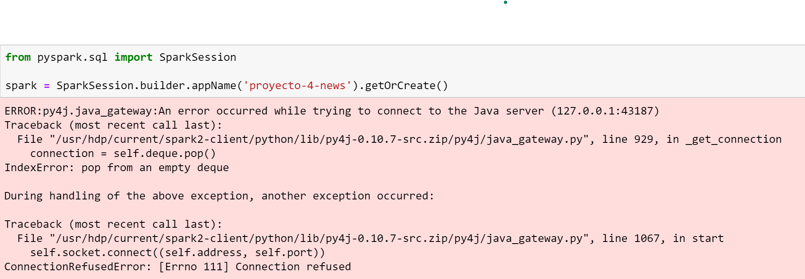

# News Analysis with pyspark

# Table of Contents
1. [Context](#context)
2. [Data Preparation] (#DataPre)
3. [Data Analytics Kmeas] (#kmeans)
4. [Data Analytics Paredes] (#paredes)
5. [Deployment](#Deployment)
6. [Honor Code](#code)

## 1. Context 
We were tasked with performing big data analitycs to a set of more than 100,000 news articles written in english.
The dataset can be found in https://www.kaggle.com/snapcrack/all-the-news. It consists of three .csv files each with around 50,000 articles, though to ease the burden, we chose to blend the files into a single articles.csv file that was used for the analysis.

## 2. Data Preparation 

## 3. Data Analytics Kmeas 

## 4. Data Analytics Paredes 

## 5. Deployment 
We worked in two environments, the first was AWS using notebooks with pyspark on top of a EMR cluster, there the data was stored in s3 in the following url:

    's3://tet-project-3/data-csv/join/articles.csv'

Our second environment was the ADC, again using notebooks with pyspark, but this time the data was stored in the cluster's hdfs in the following path:
    
    'hdfs:///user/jortizp/datasets/articles.csv'
    
After several attempts the ADC kept on failing with the same error that wouldn't let us create the pyspark application for the notebooks. The error is in the following image:

You can find the  notebooks in this repository, they are very self explanatory, the only difference between the notebooks here (The ones used in AWS) and the ones in the ADC is the url we use to load the data, in the ADC we do it as follows:

    datasets = 'hdfs:///user/jortizp/datasets/'
    df = spark.read.csv(datasets + 'articles.csv',inferSchema=True,header=True)
    
Aside from that everything else is the same, we made heavy use of pyspark.ml since it had pretty much everything we needed. We mainly used KMeans for text grouping, LDA for topic modeling and RegexTokenizer for data preparation.

The data to both s3 and the ADC's hdfs was done using a web interface, s3's web interface and ambari (http://http://192.168.10.116:8080/) respectively.

The ACD notebooks are under (http://192.168.10.116:8889/user/jortizp/tree), but as mentioned before there is an error that won't allow the notebooks to work.

## 3. Honor Code 

### Juan Gonzalo Quiroz

I, Juan Gonzalo Quiroz Cadavid, declare that all the content aported by me is of my own authorship, and those slices of code that don't belong to me are explicitly  referenced. I contributed in the phase of data preparation, documentation, Kmeans implementation and deployment on EMR.

### Valentino Malvarmo
I, Valentino Malvarmo, declare that all the content aported by me is of my own authorship. I contributed in the phase of data preparation, documentation, topic modeling and the deployment of the notebooks in the ADC.

### William Cadenas
