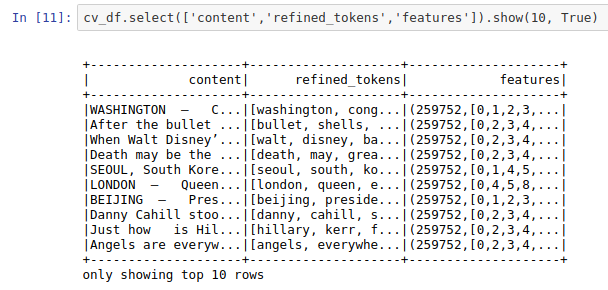
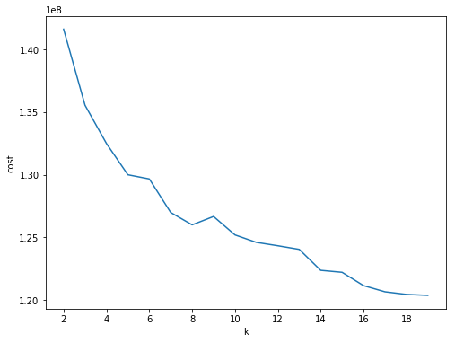
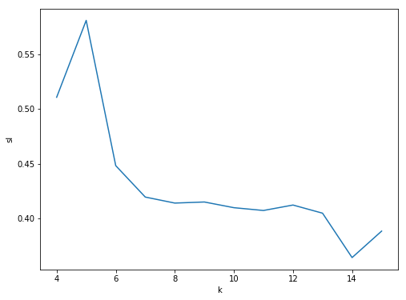
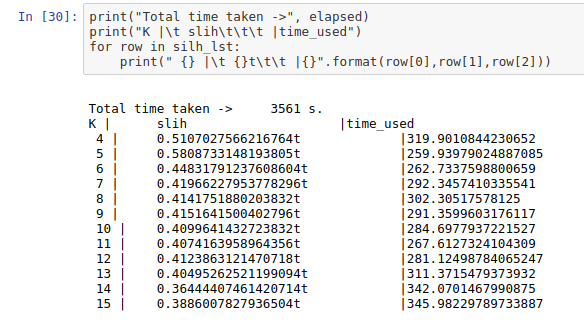
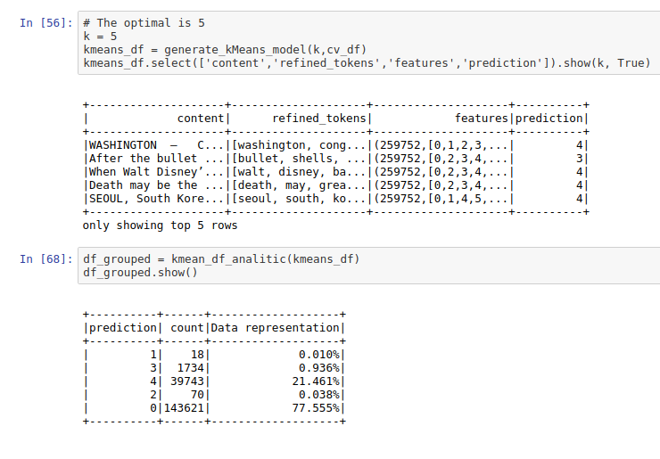
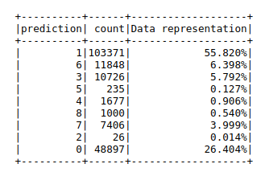
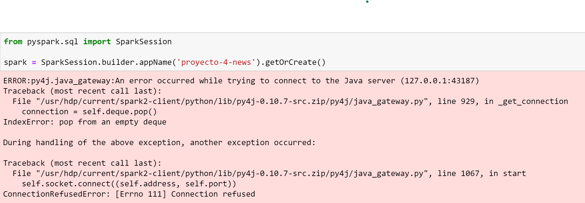

# News Analysis with pyspark

# Table of Contents
1. [Context](#context)
2. [Data Preparation](#DataPre)
3. [Data Analytics Kmeas](#kmeans)
4. [Data Analytics Paredes](#paredes)
5. [Deployment](#Deployment)
6. [Honor Code](#code)

```python

```

## 1. Context <a name="context"></a>
We were tasked with performing big data analitycs to a set of more than 100,000 news articles written in english.
The dataset can be found in https://www.kaggle.com/snapcrack/all-the-news. It consists of three .csv files each with around 50,000 articles, though to ease the burden, we chose to blend the files into a single articles.csv file that was used for the analysis.

## 2. Data Preparation <a name="DataPre"></a>

Firstly, we need to fetch the data from s3 bucket

```python
df =spark.read.csv('s3n://tet-project-3/data-csv/join/articles.csv',inferSchema=True,header=True)
df.describe()

```

Then, in order to avoid data problems with null values we must to remove them.

```python
#Removing null values
df.where(col("content").isNull()).show()

from pyspark.sql.functions import when, col, coalesce, array
fill = array().cast("string")
null_free = coalesce(col("content"), fill)
null_free_df = df.withColumn("null_free", null_free)

```
In order to do the data cleaning we used RegexTokenizer where we specified a regrex expression in order to remove special characters (pattern='[A-Za-z0-9]+') and we specified the minimun length token (minTokenLength=2)

```python
from pyspark.ml.feature import RegexTokenizer

tokenization=RegexTokenizer(minTokenLength=2 \
    ,gaps=False \
    ,pattern='[A-Za-z0-9]+' \
    ,inputCol="null_free" \
    ,outputCol='tokens')

tokenized_df=tokenization.transform(null_free_df)

```

Finally, we removed the stopwords.

```python
from pyspark.ml.feature import StopWordsRemover
stopword_removal=StopWordsRemover(inputCol='tokens'\
    ,outputCol='refined_tokens' )

refined_df=stopword_removal.transform(tokenized_df)
```

Finally we conclude with a vectorization proccess in wich we implement CountVectorizer for this job.


```python
# Count Vectorizer
from pyspark.ml.feature import CountVectorizer

count_vec = CountVectorizer(inputCol='refined_tokens' \
    ,outputCol='features')

cv_df=count_vec.fit(refined_df).transform(refined_df)
```

That was the process for data preparation.

The process could be seen as the next picture 

```python
cv_df.select(['content','refined_tokens','features']).show(10, True)
```




## 3. Data Analytics Kmeas <a name="kmeans"></a>

In order to implement K-means, we need to figure out how many cluster does we want to achive; in order to do that, we used two apprachs, firstly the Elbow method that create n models, each one with different K value then It calculated each compute the cost. The main idea is to select one that is before the gprah normalize its derivation (the point of inflection on the curve). Lets look the code and the graph

```python
from pyspark.ml.clustering import KMeans

import numpy as np
cost = np.zeros(20)

for k in range(2,20):
    print("On progress -> K:",k)
    kmeans = KMeans()\
            .setK(k)\
            .setSeed(1) \
            .setFeaturesCol("features")\
            .setPredictionCol("prediction")

    model = kmeans.fit(cv_df)
    cost[k] = model.computeCost(cv_df) # requires Spark 2.0 or later

```
The compute cost was.
```python
[
0.0,
0.0,
141618503.0239381,
135548737.71649304,
132498924.75738414,
130001866.08594018,
129669847.53486447,
126992486.45820226,
126005391.3878738,
126674296.42891622,
125201728.46645792,
124607650.1308867,
124337556.3800629,
124049005.8776054,
122377017.12177089,
122218967.42211193,
121157573.45078428,
120665480.17892012,
120456281.04646748,
120378824.04720232,
]
```

To see better, lets plot.

```python
import numpy as np
import matplotlib.mlab as mlab
import matplotlib.pyplot as plt
import seaborn as sbs
from matplotlib.ticker import MaxNLocator

fig, ax = plt.subplots(1,1, figsize =(8,6))
ax.plot(range(2,20),cost[2:20])
ax.set_xlabel('k')
ax.set_ylabel('cost')
ax.xaxis.set_major_locator(MaxNLocator(integer=True))
plt.show()
```



We can exploit that plot to see that good points could be 5, 9 and 17.

In order to choose one, we could use an other method for this that is call the Silhouette analysis.

```python
import time;
import numpy as np

from pyspark.ml.clustering import KMeans
from pyspark.ml.evaluation import ClusteringEvaluator

def optimal_k(df_in,index_col,k_min, k_max):
    '''
    Determine optimal number of clusters by using Silhoutte Score Analysis.
    :param df_in: the input dataframe
    :param index_col: the name of the index column
    :param k_min: the train dataset
    :param k_min: the minmum number of the clusters
    :param k_max: the maxmum number of the clusters
    :param num_runs: the number of runs for each fixed clusters

    :return k: optimal number of the clusters
    :return silh_lst: Silhouette score
    :return r_table: the running results table

    :author: Wenqiang Feng
    :email:  von198@gmail.com
    '''

    start = time.time()
    
    silh_lst = []
    k_lst = np.arange(k_min, k_max+1)

    for k in k_lst:
        time_per_k = time.time()
        # Trains a k-means model.
        kmeans = KMeans()\
                .setK(k)\
                .setSeed(1)
        model = kmeans.fit(df_in)

        # Make predictions
        predictions = model.transform(df_in)

        # Evaluate clustering by computing Silhouette score
        evaluator = ClusteringEvaluator()
        silhouette = evaluator.evaluate(predictions)
        
        #Timming
        elapsed =  time.time() - time_per_k
        total_time = "%8.0f s."%(elapsed)
        silh_lst.append([k,silhouette,elapsed])
    
    elapsed = time.time() - start
    elapsed =  "%8.0f s."%(elapsed)
    print('+------------------------------------------------------------+')
    print("|         The finding optimal k phase took ", elapsed, "    |")
    print('+------------------------------------------------------------+')


    return silh_lst,elapsed
```

With this method we should select the one that is more close to 1, lets see the results.







Giving that we could close our options to 5 ( The highest ), but between 5 and 8 the differences are only one unity, lets see how they work grouping

The functions used are.

```python
from pyspark.ml.clustering import KMeans
def generate_kMeans_model (k, dt_intern):
    kmeans = KMeans()\
            .setK(k)\
            .setSeed(1) \
            .setFeaturesCol("features")\
            .setPredictionCol("prediction")

    model = kmeans.fit(dt_intern)
    return model.transform(dt_intern)
```
```python
from pyspark.sql.functions import udf
from pyspark.sql.types import StringType

def kmean_df_analitic(df_kmean):
    grouped_df = df_kmean.groupBy('prediction').count()
    total = df_kmean.count()
    
    porcent_udf = udf(lambda row_count: '{:.3f}%'.format((row_count / total) * 100 ), StringType())
    return grouped_df.withColumn('Data representation', porcent_udf(grouped_df['count']))
```
#### With  K = 5


#### With  K = 9




although with 9 we got more representation between the goups there is still 2 majors groups tha bunch the majority of them, we as a team decided to use 5.


## 4. Data Analytics Topic modeling <a name="paredes"></a>
Details inside the topic-modeling notebook
    
    ./topic-modeling/topic-modeling.ipynb

## 5. Deployment <a name="Deployment"></a>
We worked in two environments, the first was AWS using notebooks with pyspark on top of a EMR cluster, there the data was stored in s3 in the following url:

    's3://tet-project-3/data-csv/join/articles.csv'

Our second environment was the ADC, again using notebooks with pyspark, but this time the data was stored in the cluster's hdfs in the following path:
    
    'hdfs:///user/jortizp/datasets/articles.csv'
    
After several attempts the ADC kept on failing with the same error that wouldn't let us create the pyspark application for the notebooks. The error is in the following image:



You can find the  notebooks in this repository, they are very self explanatory, the only difference between the notebooks here (The ones used in AWS) and the ones in the ADC is the url we use to load the data, in the ADC we do it as follows:

    datasets = 'hdfs:///user/jortizp/datasets/'
    df = spark.read.csv(datasets + 'articles.csv',inferSchema=True,header=True)
    
Aside from that everything else is the same, we made heavy use of pyspark.ml since it had pretty much everything we needed. We mainly used KMeans for text grouping, LDA for topic modeling and RegexTokenizer for data preparation.

The data to both s3 and the ADC's hdfs was done using a web interface, s3's web interface and ambari (http://http://192.168.10.116:8080/) respectively.

The ACD notebooks are under (http://192.168.10.116:8889/user/jortizp/tree), but as mentioned before there is an error that won't allow the notebooks to work.

## 3. Honor Code <a name="code"></a>

### Juan Gonzalo Quiroz

I, Juan Gonzalo Quiroz Cadavid, declare that all the content aported by me is of my own authorship, and those slices of code that don't belong to me are explicitly  referenced. I contributed in the phase of data preparation, documentation, Kmeans implementation and deployment on EMR.

### Valentino Malvarmo
I, Valentino Malvarmo, declare that all the content aported by me is of my own authorship. I contributed in the phase of data preparation, documentation, topic modeling and the deployment of the notebooks in the ADC.

### William Cadenas
